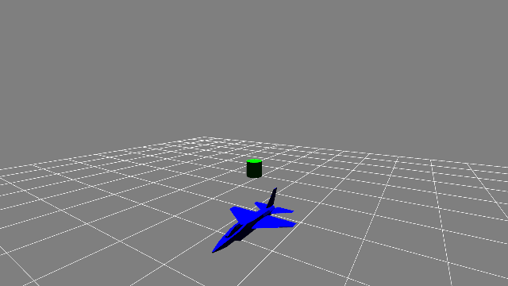

# JSBSim: Advanced Flight Control Simulation Test Bed for Novel Deep Learning Architectures

This repository presents an advanced Gym/Gymnasium environment for aircraft flight control using JSBSim, featuring an F-16 aerodynamics model. This work extends the original [JSBSim Gym Environment by zgoddard3](https://github.com/zgoddard3/jsbsim-gym) by incorporating several novel deep learning components for reinforcement learning agents, including Latent Meta Attention (LMA) for feature extraction, Advantage Modulation with Proximal Policy Optimization (AM-PPO), and a custom dynamic learning rate optimizer (DynamicAlphaGrad). The purpose of this repository is to maintain a test bed sandbox of scenarios that are require higher complexity and modularity for testing novel innovations.



## Core Modifications and Contributions

This fork significantly enhances the original environment and agent architecture by introducing:

1.  **Environment Enhancements:**
    *   **State Stacking:** The environment observation space has been modified to provide a history of states (stacked frames) to the agent, enabling the learning of temporal dependencies.
    *   **Gymnasium API:** Updated to conform to the modern Gymnasium API (from OpenAI Gym).
    *   **Angle Normalization:** Robust angle normalization is implemented to ensure consistent state representations.

2.  **Latent Meta Attention (LMA) for Feature Extraction:**
    *   A novel attention mechanism, LMA, is implemented as a feature extractor (`jsbsim_gym/LMA_features.py`). LMA operates on a latent representation of the input sequence, achieved through a unique two-stage embedding and head-view stacking pipeline, aiming for computational efficiency and potentially richer feature interactions. (Lead Author: Soham Sane || Johns Hopkins University || Collins Aerospace)

3.  **Advantage Modulation with Proximal Policy Optimization (AM-PPO):**
    *   Implementation of the AM-PPO algorithm, which dynamically modulates advantages to stabilize and improve PPO training. (Soham Sane || Johns Hopkins University || Collins Aerospace)
    *   The Stable Baselines3 implementation can be found within this repository at `stable_baselines3/ppo/ppo.py`.
    *   Paper can be found at - [AM-PPO](https://arxiv.org/abs/2505.15514)

4.  **DynamicAlphaGrad Optimizer:**
    *   A custom optimizer, DynamicAlphaGrad (DAG), designed to dynamically adjust learning rates based on gradient statistics, is integrated as an option for training AM-PPO. (Lead Author: Soham Sane || Johns Hopkins University || Collins Aerospace)
    *   The PyTorch implementation is available at: [PyTorch-DynAG](https://github.com/Soham4001A/DynamicAlphaGrad)

## Table of Contents

*   [Installation](#installation)
*   [Usage](#usage)
    *   [Training](#training)
    *   [Testing and Visualization](#testing-and-visualization)
*   [Key Architectural Innovations](#key-architectural-innovations)
    *   [Latent Meta Attention (LMA)](#latent-meta-attention-lma)
        *   [Introduction to LMA](#introduction-to-lma)
        *   [LMA Transformation Pipeline](#lma-transformation-pipeline)
        *   [Latent Attention Calculation](#lma-latent-attention-calculation)
        *   [Complexity Analysis](#lma-complexity-analysis)
    *   [Advantage Modulation PPO (AM-PPO)](#advantage-modulation-ppo-am-ppo)
    *   [DynamicAlphaGrad (DAG) Optimizer](#dynamicalphagrad-dag-optimizer)
*   [File Structure](#file-structure)
*   [Future Work](#future-work)
*   [Acknowledgements](#acknowledgements)
*   [References](#references)

## Installation

1.  **Python Environment:** Python 3.9+ is recommended. Create a virtual environment:
    ```bash
    python -m venv jsbsim_env
    source jsbsim_env/bin/activate # On Windows: jsbsim_env\Scripts\activate
    ```
2.  **Dependencies:** Install required Python packages:
    ```bash
    pip install -r requirements.txt
    ```
    (Ensure `requirements.txt` includes `numpy`, `torch`, `stable-baselines3`, `gymnasium`, `jsbsim` (the Python package), `moderngl`, `pygame`, `imageio`, `imageio-ffmpeg`).

## Usage

### Training

The `train.py` script allows training an agent using either Proximal Policy Optimization (PPO) with optional AM-PPO extensions, or Soft Actor-Critic (SAC).

(NOTE: Future works include - LMA support for other standard policies, orignal environment configuration, more scenarios and diverse enviornments)

**Command Line Arguments for `train.py`:**

*   `--algorithm TEXT`: RL algorithm to use (`ppo` or `sac`). Default: `ppo`.
*   `--cuda_device`: Use CUDA if available.
*   `--total_timesteps INTEGER`: Total number of training timesteps. Default: 3,000,000.
*   `--seed INTEGER`: Random seed. Default: 1.
*   `--learning_rate FLOAT`: Learning rate. Default: 3e-4.
*   `--gamma FLOAT`: Discount factor. Default: 0.99.
*   **PPO Specific:**
    *   `--n_steps_ppo INTEGER`: Number of steps per rollout per environment for PPO. Default: 2048.
    *   `--batch_size_sac_ppo INTEGER`: Minibatch size for PPO/SAC updates. Default: 256.
    *   `--n_epochs_ppo INTEGER`: Number of optimization epochs per PPO update. Default: 10.
    *   ... (other PPO args like `gae_lambda_ppo`, `clip_range_ppo`, etc., can be found in `train.py --help`)
*   **AM-PPO Specific (use with `--algorithm ppo --use_am_ppo`):**
    *   `--use_am_ppo`: Enable AM-PPO extensions.
    *   `--am_ppo_optimizer TEXT`: Optimizer for AM-PPO (`Adam`, `AlphaGrad`, `DAG`). Default: `DAG`.
    *   ... (all `dynago_` and other AM-PPO parameters as defined in `train.py --help`)

**Example Training Commands:**

*   Train standard SAC with LMA features:
    ```bash
    python train.py --algorithm SAC --total_timesteps 1000000
    ```
*   Train AM-PPO with LMA features and DAG optimizer:
    ```bash
    python train.py --algorithm ppo --use_am_ppo --am_ppo_optimizer DAG --total_timesteps 1000000
    ```
Trained models are saved in the `models/` directory. Training can take a significant amount of time depending on hardware and `total_timesteps`.

### Testing and Visualization

The `test.py` script loads a trained model and runs it for one episode, visualizing the environment and saving the output to MP4 and GIF.

```bash
python test.py
```
By default, it attempts to load `models/jsbsim_am_ppo_stacked_lma`. You can modify `test.py` to load different models. Videos are saved as `video.mp4` and `video.gif` in the script's directory.

(NOTE: This test was orignally written for generating the video with AM-PPO so it may break.)

## Key Architectural Innovations

### Latent Meta Attention (LMA)
*(Lead Author: Soham Sane || Johns Hopkins University || Collins Aerospace)*

LMA is a novel attention mechanism designed for computational efficiency and potentially richer feature interactions by operating within a reduced-dimensionality latent space. (A research paper detailing LMA is currently in preparation.)

#### Introduction to LMA

The Transformer architecture [Vaswani et al., 2017] has revolutionized sequence modeling across diverse domains, from natural language processing [Devlin et al., 2018; Brown et al., 2020] to computer vision [Dosovitskiy et al., 2020]. Its success is largely attributed to the Multi-Head Self-Attention (MHA) mechanism, which excels at capturing long-range dependencies.

**The Attention Landscape and Its Challenges**

Standard MHA faces a significant challenge: its computational complexity scales quadratically ($O(L^2 D)$) with the input sequence length $L$ and embedding dimension $D$. This becomes prohibitive for very long sequences. Traditional input processing involves either direct projection or chunk-wise embedding.

**Motivation: Efficiency, Richer Interactions, and Re-evaluating Attention**

The quadratic complexity of MHA and the trend towards larger models necessitate more efficient attention mechanisms. LMA re-evaluates the MHA paradigm, questioning whether the "Query," "Key," and "Value" semantics are strictly necessary, or if attention's effectiveness emerges from its structured sequence of operations. LMA explores alternative operational sequences, particularly those involving structured transformations and dimensionality reduction *before* the core interaction calculation.

**Background & Related Work on Efficient Attention**

Existing efficient attention methods include Grouped-Query Attention (GQA) [Ainslie et al., 2023] and Multi-Query Attention (MQA) [Shazeer, 2019] (reducing KV cache for inference), sparse attention (e.g., Longformer [Beltagy et al., 2020]), linearized attention (e.g., Performer [Choromanski et al., 2020]), and latent space attention like DeepSeek's Multi-head Latent Attention (MLA) [DeepSeek-AI, 2024].

LMA distinguishes itself through a unique **two-stage sequence embedding pipeline** to generate its latent space. Critically, **all LMA components (Q', K', V') operate entirely within this reduced latent space**, unlike MLA's partial reduction.

#### LMA Transformation Pipeline

The transformation from an input block $X_{in}$ to the latent representation $Z$ involves:

**1. Stage 1: Initial Sequencing & Embedding**
If the input is a flat vector $X_{raw} \in \mathbb{R}^{B \times N}$, it's reshaped into $L$ chunks of size $C_{in} = N / L$. A shared embedding layer, $\text{EmbedLayer}_1$, maps each chunk $C_{in} \rightarrow d_0$:
```math
Y = \text{EmbedLayer}_1(\text{Reshape}(X_{raw})) \in \mathbb{R}^{B \times L \times d_0}
```

**2. Stage 2: Head-View Stacking & Latent Re-Embedding**
   **a. Head-View Stacking:** $Y$ is split along its embedding dimension $d_0$ into $N_h$ segments (heads), each $Y_i \in \mathbb{R}^{B \times L \times d_h}$ where $d_h = d_0 / N_h$. These segments are then concatenated *sequentially* along the sequence dimension:
   ```math
   X_{stacked} = \text{Concat}_{\text{axis=1}} (Y_1, Y_2, ..., Y_{N_h}) \in \mathbb{R}^{B \times (L \cdot N_h) \times d_h}
   ```
   This creates a longer, thinner intermediate sequence.

   **b. Re-Chunking & Latent Embedding:** The stacked tensor $X_{stacked}$ (total features per batch item $L \cdot d_0$) is reshaped into a new sequence of length $L'$, where each new "chunk" has size $C' = (L \cdot d_0) / L'$. A second shared embedding layer, $\text{EmbedLayer}_2$, maps each chunk of size $C'$ to the target latent dimension $d'$:
   ```math
   Z = \text{EmbedLayer}_2(\text{Reshape}(\text{Flatten}(X_{stacked}))) \in \mathbb{R}^{B \times L' \times d'}
   ```
   This second embedding stage efficiently compresses the combined head-view information into the final latent space $Z$.

#### LMA Latent Attention Calculation
Attention operates entirely on the latent representation $Z$. Latent Query ($Q'$), Key ($K'$), and Value ($V'$) are computed via linear projections ($W_{Q'}, W_{K'}, W_{V'}$) from $Z$, mapping $d' \rightarrow d'$ or to a latent head dimension $d'_{head}$:
```math
Q' = Z W_{Q'}; \quad K' = Z W_{K'}; \quad V' = Z W_{V'}
```
Scaled dot-product attention is then applied:
```math
\text{AttnOut} = \text{softmax}\left( \frac{Q' {K'}^T}{\sqrt{d'_{head}}} \right) V' \in \mathbb{R}^{B \times L' \times d'}
```
The $O((L')^2)$ complexity of this step provides the main computational speedup. Due to the sequential head-view stacking, this latent attention can be conceptualized as a form of self-comparison on a meta-representation of the original sequence's features.

#### Integration and Residual Connections in LMA
LMA utilizes standard Transformer-style residual connections and Layer Normalization. The input $Z$ to the latent attention module serves directly as the input for the first residual sum:
```math
\text{Out}_1 = \text{LayerNorm}(Z + \text{Dropout}(\text{AttnOut}))
```
This is dimensionally consistent without requiring an extra projection for the residual path. This is followed by a Feed-Forward Network (FFN) operating within the latent dimension $d'$, and a second residual connection:
```math
Z_{out} = \text{LayerNorm}(\text{Out}_1 + \text{Dropout}(\text{FFN}(\text{Out}_1)))
```

#### LMA Complexity Analysis
LMA's computational cost (FLOPs), ignoring biases and activations, is roughly:
```math
O(B (N d_0 + L d_0 d' + 3 L' (d')^2 + 2 (L')^2 d' + 2 L' d' d'_{ffn}))
```
This is compared to MHA's:
```math
O(B (4 L d_0^2 + 2 L^2 d_0 + 2 L d_0 d_{ff}))
```
LMA achieves significant efficiency gains when $L' \ll L$ and $d' \ll d_0$, as the $L^2 d_0$ term in MHA typically dominates for long sequences.
The precise condition for LMA being computationally cheaper is:
```math
B (N d_0 + L d_0 d') + B (3 L' (d')^2 + 2 (L')^2 d') < B (4 L d_0^2 + 2 L^2 d_0)
```
(Comparing embedding and attention costs, excluding FFNs for simplicity here).

The LMA feature extractors (`LMAFeaturesExtractor` for general 1D sequential input, and `StackedLMAFeaturesExtractor` for 2D stacked frame input from the environment) are implemented in `jsbsim_gym/LMA_features.py`.

### Advantage Modulation PPO (AM-PPO)
*(Lead Author: Soham Sane || Johns Hopkins University || Collins Aerospace)*

To enhance training stability and performance of Proximal Policy Optimization (PPO), this repository incorporates Advantage Modulation PPO (AM-PPO). AM-PPO dynamically adjusts the scale and distribution of advantage estimates during training using insights from control theory and statistical properties of the advantages. This adaptive mechanism aims to prevent overly large policy updates and improve sample efficiency.

**Key Concepts of AM-PPO:**
*   **Dynamic Advantage Normalization:** Modulates advantages based on their batch-wise statistics (norm, standard deviation) and a target saturation rate for an intermediate transformed variable.
*   **EMA Tracking:** Uses Exponential Moving Averages (EMAs) to track key controller states (e.g., estimated scaling factor $\alpha_A$, observed saturation $p_A$).
*   **Configurable Controller:** Parameters like target saturation $p^*$, controller gain $\kappa$, and EMA decay rates $\rho$ allow tuning the modulation behavior.

**Paper:** For a detailed explanation of AM-PPO, refer to the paper:
Sane, S., et al. (2024). *Advantage Modulation with Proximal Policy Optimization for Reinforcement Learning*. arXiv preprint arXiv:2405.15514. Available at: [AM-PPO](https://arxiv.org/abs/2405.15514)

**Implementation:** The AM-PPO algorithm is integrated into the PPO implementation within this repository's modified Stable Baselines3 version:
`stable_baselines3/ppo/ppo.py`. It can be enabled using the `--use_am_ppo` flag in `train.py`.

### DynamicAlphaGrad (DynAG) Optimizer
*(Lead Author: Soham Sane || Johns Hopkins University || Collins Aerospace)*

DynamicAlphaGrad (DynAG) is a custom PyTorch optimizer designed as an adaptive learning rate method. It extends principles from AlphaGrad by dynamically adjusting both the step size (learning rate) and a "momentum-like" parameter ($\alpha$) based on the statistics of gradients encountered during training.

**Core Ideas of DynAG:**
*   **Adaptive Step Size:** Similar to Adam or RMSProp, scales learning rates per parameter.
*   **Dynamic $\alpha$ Parameter:** The $\alpha$ term, which in AlphaGrad influences the update's reliance on current vs. past gradient information, is itself made adaptive in DynAG. This allows the optimizer to potentially switch between Adam-like and SGD-with-momentum-like behavior based on the optimization landscape.
*   **Gradient Statistics:** Utilizes first and second moments of the gradients to inform its updates.

**Implementation:** The DynAG optimizer is available as a standalone PyTorch optimizer:
*   **GitHub Repository:** [https://github.com/Soham4001A/DynamicAlphaGrad](https://github.com/Soham4001A/DynamicAlphaGrad)

In this project, DynAG can be selected as the optimizer for AM-PPO training via the `--am_ppo_optimizer DAG` command-line argument in `train.py`. The custom optimizers, including DynAG, are located in `stable_baselines3/ppo/optim/`.

(NOTE: Yes it was renamed, I haven't had the time to change it)

## File Structure

*   `jsbsim_gym/jsbsim_gym.py`: Defines the core `JSBSimEnv` and the `PositionReward` wrapper. Contains environment registration.
*   `jsbsim_gym/LMA_features.py`: Implements `LMAFeaturesExtractor`, `StackedLMAFeaturesExtractor`, and the standard `Transformer` feature extractor. Includes LMA core components.
*   `jsbsim_gym/features.py`: (Based on original repo) Defines `JSBSimFeatureExtractor` used as the per-frame extractor within `StackedLMAFeaturesExtractor`.
*   `jsbsim_gym/visualization/`: Auxiliary files for rendering the environment (e.g., `rendering.py`, `quaternion.py`, shader files (`simple.vert`, `simple.frag`, `unlit.frag`), and `.obj` models (`f16.obj`, `cylinder.obj`)).
*   `train.py`: Script for training RL agents (SAC, PPO, AM-PPO).
*   `test.py`: Script for testing a trained agent and generating video/GIF.
*   `stable_baselines3/`: Modified version of Stable Baselines3, notably `ppo/ppo.py` for AM-PPO and `ppo/optim/` for custom optimizers.
*   `models/`: Directory where trained models are saved.
*   `logs/`: Directory for TensorBoard training logs.
*   `requirements.txt`: Python package dependencies.


## Acknowledgements

This project is a fork and extension of the original JSBSim Gym Environment developed by **Zachary Goddard (zgoddard3)**, available at [https://github.com/zgoddard3/jsbsim-gym](https://github.com/zgoddard3/jsbsim-gym). The core JSBSim simulation environment and rendering logic are based on their excellent foundational work.

The F-16 aircraft model and JSBSim flight dynamics simulation software are products of the open-source JSBSim project.

## References

*   Ainslie, J., Lee-Thorp, J., de Jong, M., Zemlyanoy, D., Sanghai, S., & Patrick, S. (2023). GQA: Training Generalized Multi-Query Transformer Models from Multi-Head Checkpoints. *arXiv preprint arXiv:2305.13245*.
*   Beltagy, I., Peters, M. E., & Cohan, A. (2020). Longformer: The Long-Document Transformer. *arXiv preprint arXiv:2004.05150*.
*   Brown, T. B., Mann, B., Ryder, N., Subbiah, M., Kaplan, J., Dhariwal, P., ... & Amodei, D. (2020). Language Models are Few-Shot Learners. *Advances in Neural Information Processing Systems, 33*.
*   Choromanski, K., Likhosherstov, V., Dohan, D., Song, X., Gane, A., Sarlos, T., ... & Weller, A. (2020). Rethinking Attention with Performers. *arXiv preprint arXiv:2009.14794*.
*   Devlin, J., Chang, M. W., Lee, K., & Toutanova, K. (2018). Bert: Pre-training of Deep Bidirectional Transformers for Language Understanding. *arXiv preprint arXiv:1810.04805*.
*   Dosovitskiy, A., Beyer, L., Kolesnikov, A., Weissenborn, D., Zhai, X., Unterthiner, T., ... & Houlsby, N. (2020). An Image is Worth 16x16 Words: Transformers for Image Recognition at Scale. *arXiv preprint arXiv:2010.11929*.
*   Sane, S., et al. (2025). Advantage Modulation with Proximal Policy Optimization for Reinforcement Learning. *arXiv preprint arXiv:2405.15514*.
*   Shazeer, N. (2019). Fast Transformer Decoding: One Write-Head is All You Need. *arXiv preprint arXiv:1911.02150*.
*   Vaswani, A., Shazeer, N., Parmar, N., Uszkoreit, J., Jones, L., Gomez, A. N., ... & Polosukhin, I. (2017). Attention is All You Need. *Advances in Neural Information Processing Systems, 30*.
*   DeepSeek-AI. (2024). DeepSeek LLM: Scaling Open-Source Language Models with Longterm Attention. *arXiv preprint arXiv:2401.02954*.
